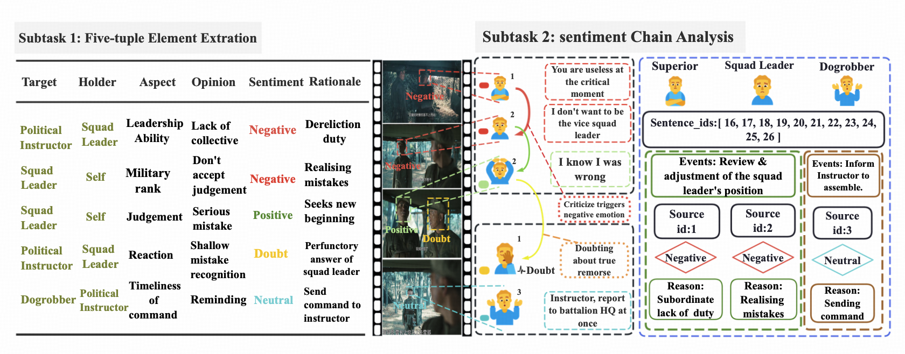
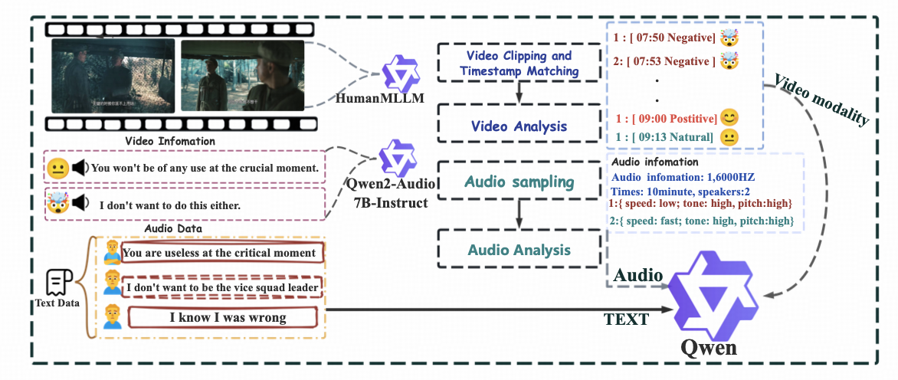
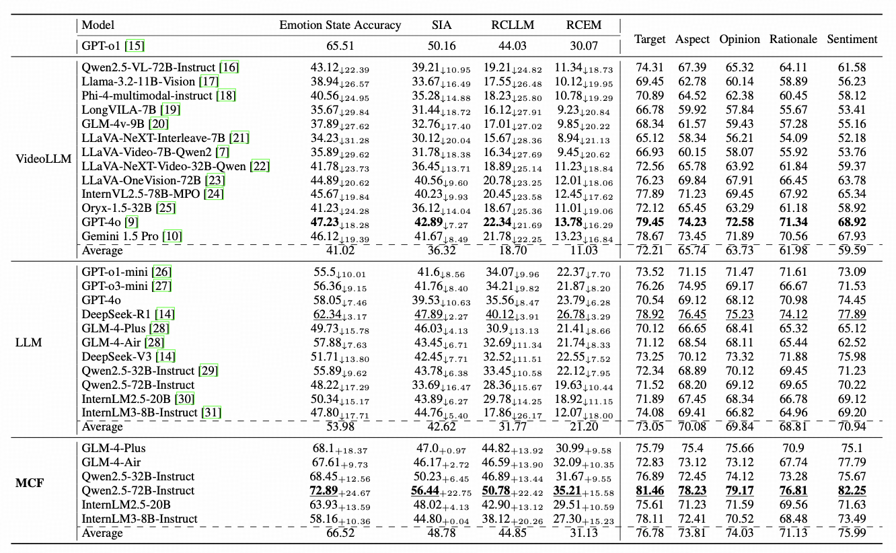

# MCF: Text LLMS For Multimodal Emotional Causality

<div align="center">

[](#)
[](https://huggingface.co/datasets/ZHANGYUXUAN-zR/MCF-Dataset)
</div>

## Data

Dataset task definition and annotation example of the MCF framework. The framework contains two core subtasks:
five-tuple
element extraction (identifying Target, Holder, Aspect, Opinion, Sentiment, and Rationale) and sentiment chain
analysis (constructing causal
relationship chains between emotional events).



The dataset is provided in [MCF-Dataset](https://huggingface.co/datasets/ZHANGYUXUAN-zR/MCF-Dataset)
with the following structure.  
Each sample includes video, audio, and dialogue subtitles:

```
|-video
    |-chat_1.mp4

|-chat
    |-chat_1.txt

|-audio
    |-chat_1.mp3
```

## MCF pipeline

The MCF (Multimodal Causality Framework) architecture. MCF employs a three-stage pipeline: Recognition extracts
multimodal features through adaptive fidelity control, Memory aggregates events to compress 200+ dialogue turns into
50-80 semantic
units, and Attribution performs cross-modal alignment and progressive reasoning to identify emotional causal chains. The
framework
transforms multimodal dialogue sequences into structured representations processable by text-based LLMs while preserving
long-distance causal
dependencies.



# Result

Impact of MCF on LLMs Performance Across Different Evaluation Metrics. The scores are reported in percentage (%). ↓and +
indicate performance decrease and increase compared to GPT-o1(text-only), respectively. Bold values represent the best
performance in each
section. Causemotion uses only the text modal. LLM refers to using only the LLM itself.



## Quick Start

1. Make sure the following models are installed:

+ google-bert/bert-base-uncased
+ google/siglip-base-patch16-224
+ openai/whisper-large-v3
+ StarJiaxing/R1-Omni-0.5B
+ Qwen/Qwen2-Audio-7B-Instruct

Change the corresponding model paths in R1-Omni-0.5B/config.json (lines 23 and 31):

```
"mm_audio_tower": "/path/to/local/models/whisper-large-v3",
"mm_vision_tower": "/path/to/local/models/siglip-base-patch16-224"
```

1. install the required packages:

```shell
pip install -r requirements.txt
```

1. In the `main` folder, run

```shell
git clone https://github.com/HumanMLLM/HumanOmni
git clone https://github.com/StarsfieldAI/R1-V
```

and keep only the `humanomni` folder. this folder will looks like

```
.
├── R1-V
├── audio.py
├── audio_convert.py
├── combined.py
├── get_emo_score.py
├── get_emo_sw.py
├── humanomni # this is humanomni folder
├── utils.py
└── video.py
```

Then in `vhumanomni_arch.py`, replace the actual path to BERT:

```python
bert_model = "/gpfs/work/aac/yulongli19/.cache/modelscope/hub/models/AI-ModelScope/bert-base-uncased"  # change to your BERT model path
```

1. Now to run:

+ We provide `convert_text` for text transcription:

    ```
    cd convert_text
    python main.py --input {chat.mp4} --api-key --parallel 8 --api-mode high
    ```

+ using with `audio_convert.py` for audio extraction:

  ```
    cd main
    python audio_convert.py --input_dir {mp4} --output_dir {mp3}
    ```

+ Once all three files (mp3, mp4, txt) are ready, first perform audio feature extraction:

    ```
  python audio.py --audio_path --model_path --output_path
    ```

+ Then extract video features:

  ```shell
    ce convert_text
  python video.py --root_dir {data} --output_dir --modal {audio or video_audio}
    ```

+ Concatenate the extracted content:

    ```shell
  python combined.py --audio_dir {audio} --input_dir {video_info} --output_dir {output}
  ```

1. After all feature extraction is done, generate the causal chains:

```shell
python get_emo_sw.py --input_dir --other_text {combined_text} --output_dir --config_path --llm_model --batch --window_sizes --step_sizes
```

# Evaluation Metrics for Multimodal Emotional Causal Reasoning

### Emotion State Accuracy (SA)

SA measures whether the predicted emotional state matches the ground-truth emotional state for each matched causal chain
pair **(c<sub>i</sub><sup>gt</sup>, ĉ<sub>j</sub>)**.

- **c<sub>i</sub><sup>gt</sup> = (s<sub>p</sub><sup>gt</sup>, u<sub>q</sub><sup>gt</sup>, e<sub>q</sub><sup>gt</sup>)**
  be the ground-truth chain,
- **ĉ<sub>j</sub> = (ŝ<sub>p</sub>, û<sub>q</sub>, ê<sub>q</sub>)** be a predicted chain,
- **ê<sub>q</sub><sup>*</sup>** be the emotional state from the **best-matching** predicted chain:

)

Then SA is:

)

where **N** is the number of matched pairs and **𝕀(·)** is the indicator function.

### Source ID Accuracy (SIA)

**Definition.** SIA checks whether the **source event position** in the best-matching predicted chain aligns with the
ground-truth source event position.

- **POS(s<sub>p</sub><sup>gt</sup>)** = set of valid position indices for the ground-truth source event
- **pos(·)** = extract the utterance index from a source event
- **ŝ<sub>p</sub><sup>*</sup>** = source event from the best-matching predicted chain (as defined via the same matching
  used for SA)

Then:

\in\mathrm{POS}(s_p^{gt})))

### Reason Consistency (RC)

We report two variants that compare the predicted rationale **\hat{R}** with the ground-truth rationale **R<sup>gt</sup>
**.

#### Embedding-based Reason Consistency

Let **E(·)** be a text-embedding function and **cos(·,·)** the cosine similarity. Then:

,E(\hat{R})))

#### LLM-based Reason Consistency

Let **I<sub>LLM</sub>(R<sup>gt</sup>, \hat{R}) ∈ {0,1}** be a binary judgment from a large language model indicating
semantic consistency. Then:

)

### Run the Benchmark

```bash
python get_emo_score.py --gt_dir --input_dir --output_dir --batch --event_threshold
```
